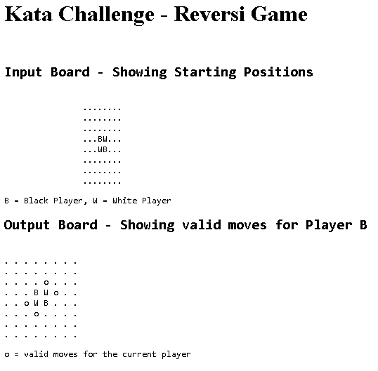

# reversi_game
Code Kata for playing the game of Reversi. 

The challenge is to write a program that takes the current board position as input, and returns a board showing the legal moves available for the current player. The challenge does not involve creating a playable game.

The rules/requirements of the challenge are here - https://codingdojo.org/kata/Reversi/

The result of the challenge currently looks like this, with one input and one output board



## To Setup & Run Locally

1. Clone repo locally then `cd` to the new directory
2. `composer install`
3. `composer start`
4. open `localhost:8093` in a browser


## To Run Unit Tests

`composer test`

NB: this is setup in `composer.json` to run with the `--testdox` option to give more readable test output, like this -
```
> phpunit tests --testdox

ReversiGame
 ✔ First Setup

Time: 177 ms, Memory: 4.00 MB

OK (3 tests, 3 assertions)
```

Without `--testdox`, the test output looks like this - 
```
> phpunit tests

.                                                                 3 / 3 (100%)

Time: 241 ms, Memory: 4.00 MB

OK (3 tests, 3 assertions)
```
